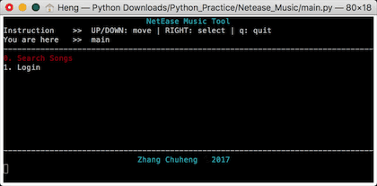

# Description

使用网易云音乐的接口，实现了搜歌以及登陆签到的功能。
本假期的最后一个python练习项目啦。
参考了[omi的项目](https://github.com/darknessomi/musicbox)。

# Log

## 2017-01-29

* base64编码方式是一种将小段二进制文件编码为字符串的编码方式，它把3个Byte编码为四个字符，字符从64元的字符集里面得到。

## 2017-01-30

* for语句的后置用法 ``mp3_url = [data[i]['mp3Url'] for i in range(0, len(data))]``
* 电话号码的正则表达式匹配 ``'^0\d{2,3}\d{7,8}$|^1[34578]\d{9}$'``

## 2017-01-31

想搞清楚这几个东西：md5, SHA, AES, binascii.hexlify, 

### MD5

* arbitrary length to 128-bit 'fingerprint' or 'message digest'
* unique
* inversion infeasible (except collision)
* digital signature before being encrypted in public-key cryptosystem (i.e. RSA)

### DES

也是一种加密标准，写了一种实现，在[这里](https://github.com/zhangchuheng123/Python_Practice/tree/master/DES)

## 2017-02-04

使用``curses``来控制屏幕，用以实现命令行程序，实现方法可以参见[http://www.cnblogs.com/starof/p/4703820.html](http://www.cnblogs.com/starof/p/4703820.html)
以及[https://docs.python.org/2/howto/curses.html](https://docs.python.org/2/howto/curses.html)

## 2017-02-05

完善了程序，实现搜索歌曲和登陆签到的功能，要开学了，就不再加入播放的功能了，祝新学期顺利！
